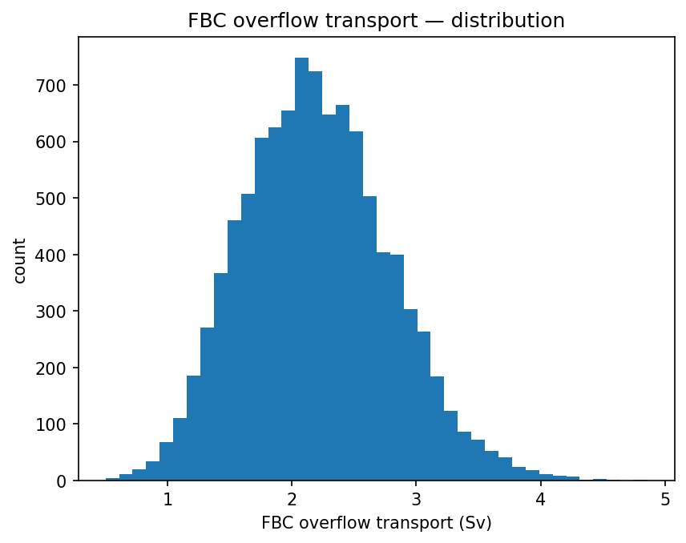
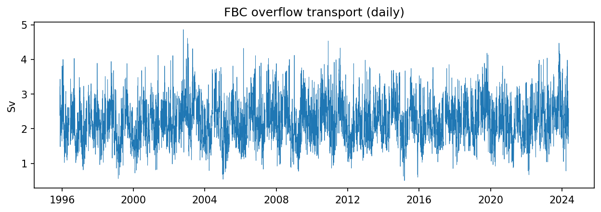
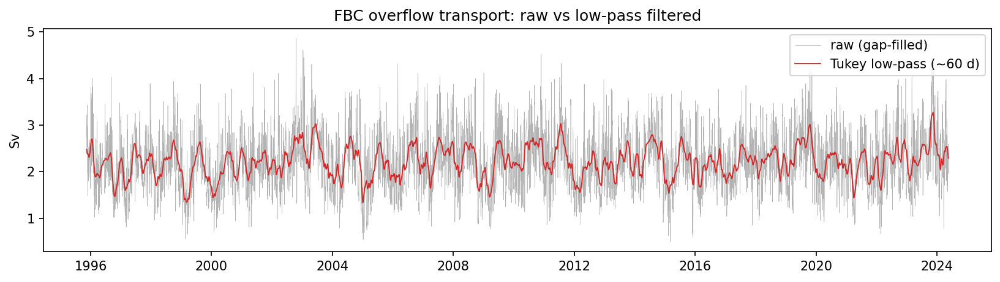
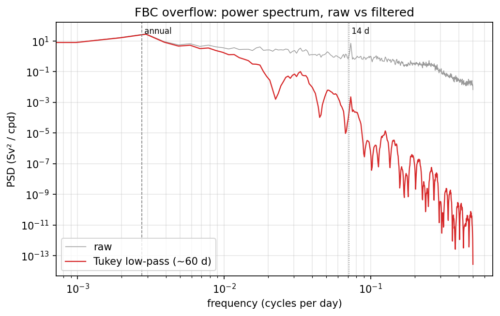
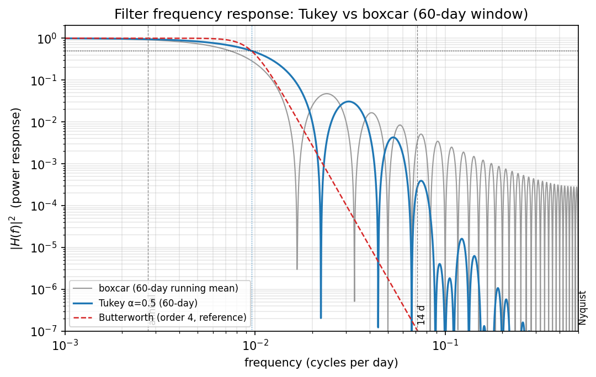

## Part A — Characterising the series

This analysis characterises the Faroe Bank Channel (FBC) overflow volume
transport — the dense overflow of cold, deep water from the Nordic Seas into the
North Atlantic across the FBC sill (~61.5°N, 8.2°W) — distributed by AMOCatlas as
the single scalar series `TRANS_FBC` (Sv). I chose it as a long, regularly
sampled, single-variable record with strong intrinsic variability, well suited to
spectral characterisation, and because the overflow limb is a distinct,
dynamically interesting component of the AMOC.

The record spans 1995-11-14 to 2024-05-18 (≈28.6 years) on a regular daily grid
(sampling interval 1 day, confirmed by a unique forward difference of 1.0 day),
giving 10,414 samples. Of these, 573 (5.5%) are missing. The gaps are not
isolated days but 28 discrete outages — 26 longer than a week, the longest 28
days — consistent with mooring servicing. I fill the interior gaps by linear
interpolation to preserve the regular grid the FFT-based estimates in Part B
require. This is a documented compromise: interpolating across multi-week blocks
acts as a local low-pass, muting genuine high-frequency variance within those
windows and adding minor spurious low-frequency structure. At 5.5% of the record,
spread over nearly three decades and averaged over many Welch segments, the effect
is small but non-zero, and I flag it rather than conceal it.

The transport has mean 2.20 Sv and standard deviation 0.59 Sv (sample std,
`ddof=1`), consistent with the long-quoted ~2 Sv FBC overflow strength; the
near-equal median (2.17 Sv) indicates only mild asymmetry. Values range from 0.50
to 4.86 Sv (range 4.36 Sv). The distribution is unimodal and approximately
Gaussian with a slight positive skew — a longer tail toward strong-overflow events,
visible as occasional excursions above ~4 Sv — while the series otherwise
fluctuates around a stable ~2.2 Sv mean with no apparent long-term trend.

## Part B — The spectrum

I estimate the power spectral density of the gap-filled series using Welch's
overlapped-segment averaging, with Hann-tapered segments of 1024 samples
(~2.8 years) and 50% overlap. This yields roughly 19 segments and therefore about
38 degrees of freedom (≈ twice the segment count), and resolves frequencies down
to ~9.8×10⁻⁴ cycles per day (cpd). The segment length is a deliberate compromise:
shorter segments (512) gave a smoother estimate but smeared the annual peak toward
the resolution floor, while longer segments (2048) sharpened that peak at the cost
of a far noisier high-frequency tail. The 1024-sample choice keeps the annual peak
distinct while remaining acceptably smooth. Each segment is linearly detrended
before transforming, so the lowest frequencies are not dominated by the mean or any
residual drift.

Integrating the estimated spectrum over frequency recovers 96.4% of the series
variance (Parseval ratio 0.964), confirming the estimate is correctly normalised;
the small shortfall is consistent with the variance trimmed by per-segment
detrending and the Hann taper.

The spectrum is markedly red: power falls by roughly two orders of magnitude from
the lowest resolved frequencies to the Nyquist frequency (1 cpd, i.e. the 2-day
period set by daily sampling), with the steepest rolloff above ~0.1 cpd. This
concentration of variance at long periods is the expected signature of an
overflow whose strength is modulated by slowly varying density and pressure
gradients across the sill, with weaker, broadband day-to-day "weather". Two
discrete timescales stand out against this red continuum. The clearest is a peak
near 2.7×10⁻³ cpd, a period of ~365 days — the annual cycle, reflecting the
seasonal modulation of the overflow. A second, sharper line appears near
7×10⁻² cpd (~14 days), consistent with the fortnightly spring–neap tidal cycle
expected at a tidally energetic sill; I flag this as plausible but tentative given
the single record. The broad band of elevated power between roughly 5×10⁻³ and
5×10⁻² cpd (periods of ~20–200 days) represents the overflow's intraseasonal and
mesoscale variability.

The two required figures make the filtering explicit.

Figure 1 overlays the ~60-day Tukey low-pass on the raw series: the filtered curve follows the slow, largely annual swings around the ~2.2 Sv mean while suppressing the daily spikes.
Figure 2 shows the corresponding spectra on log–log axes. Below the filter cutoff
the raw and filtered spectra coincide, confirming the low frequencies pass
unchanged; above it the filtered spectrum falls away steeply — by many orders of
magnitude toward Nyquist — as the high-frequency variance is removed. The
fortnightly tidal line, which is sharp in the raw spectrum, is strongly attenuated
in the filtered one, while the annual peak (in the passband) survives. The
oscillatory lobes in the filtered spectrum at the lowest frequencies are the
sidelobes of the window's frequency response, not features of the data.

A caveat carried from Part A: ~5.5% of the record was linearly interpolated across
28 multi-week gaps. Interpolation acts as a mild local low-pass, so the very
highest frequencies are modestly damped relative to a gap-free record; averaged
over many Welch segments this effect is small, but it is not zero.

## Part C — Filter design

The low-pass used for the figures is a centred, zero-phase Tukey-windowed running
mean (shape parameter α = 0.5) of length 60 samples (60 days). Its squared
frequency response (Figure C) makes the design choice explicit. The half-power
point (|H|² = 0.5) lies at ≈ 0.0096 cpd — a period of ~104 days — so the window
*length* is not the cutoff *period*: a 60-sample tapered mean passes everything
slower than ~3–4 months. This is the intended behaviour. The annual cycle at
2.7×10⁻³ cpd sits well inside the passband (|H|² ≈ 0.95, essentially
unattenuated), while the fortnightly tidal line at 7×10⁻² cpd and the broadband
daily variability are pushed into the stopband.

Comparing the Tukey against a plain boxcar (uniform running mean) of the same
60-sample length shows why the taper is worth it. The two have similar half-power
cutoffs, but their stopband behaviour differs sharply. The boxcar is a rectangular
window whose response is a sinc with sidelobes that decay only slowly, so it keeps
leaking high-frequency variance: averaged over 0.1–0.2 cpd its response is
~7.5×10⁻⁴, and near Nyquist it is still ~2×10⁻⁴. The Tukey's cosine-tapered edges
suppress these sidelobes far more effectively — over the same 0.1–0.2 cpd band its
mean response is ~2.6×10⁻⁶ (roughly 300× lower), falling to ~3×10⁻⁸ approaching
Nyquist. At the 14-day tidal frequency the Tukey attenuates by a further order of
magnitude (|H|² ≈ 2.8×10⁻⁴ versus ≈ 3.5×10⁻³ for the boxcar). The price is a
marginally wider main lobe — slightly gentler roll-off right at the cutoff — but
for isolating slow, sub-seasonal-to-annual variability while cleanly rejecting
tides and daily noise, the reduced leakage is the right trade. For reference,
Figure C also overlays an idealised 4th-order Butterworth response with the same
half-power cutoff (computed with the package's `butterworth_squared_response`),
showing the monotonic, sidelobe-free roll-off a recursive filter would give,
against which the windowed means' sidelobe ripples stand out.

